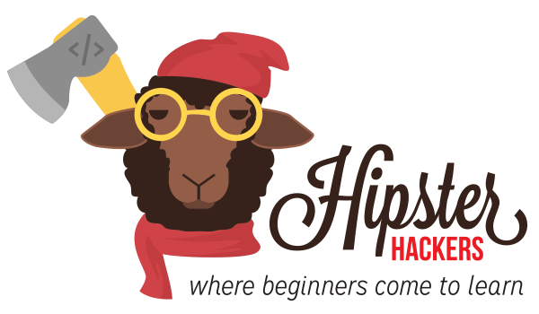

## Welcome Friends
Hipster Hackers is a group where beginners come to learn. This github repo will be used to store all of our courses here for free. If you can't make a class, don't worry, this material will be here for you to catch up.

If you're an experienced developer, and see some material that could use some improvement, please feel free to submit a pull request. We'd love to hear your feed back.

We are also always happy to welcome a guest instructor. If you'd like to come teach a class, come sit in on a class, and then we can talk about it.

### Instructors

* [Russ Smith](https://github.com/russ)
* [Jeremy Woertink](https://github.com/jwoertink)

### Social

* Follow us on [Twitter](https://twitter.com/hipsterhackers)
* RSVP on [Meetup](http://www.meetup.com/hipsterhackerslv/)
